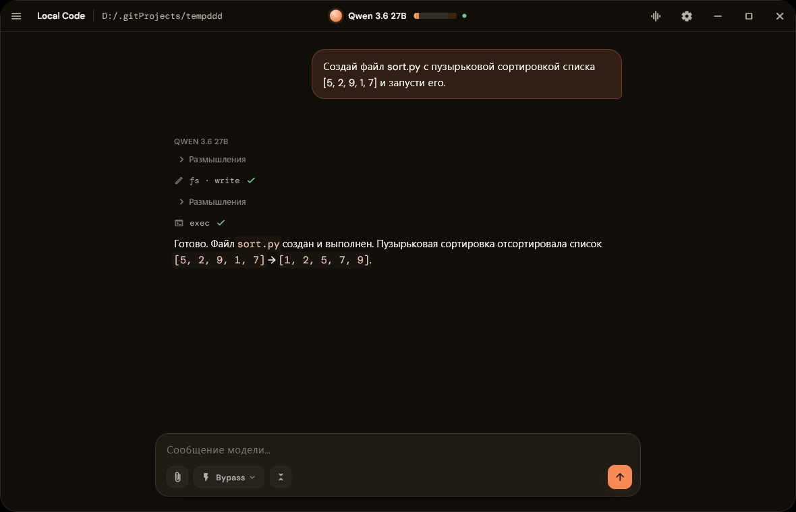

# Local Code

Кодинг-агент, который работает с твоей моделью. Десктопное приложение: подключаешь модель — а дальше агент сам читает, правит и запускает код в проекте, ищет по дереву и ведёт git. Перед изменениями спрашивает.

## Возможности

- **Файлы и шелл** — читает, пишет и правит файлы, запускает шелл хоста, ищет по проекту через glob и grep.
- **Git как инструмент** — модель сама делает status, commit, push, pull и log.
- **Режимы доступа** — bypass, accept-edits или plan; изменяющие действия ждут подтверждения.
- **Откат** — коммиты агента становятся точками отката для рабочего дерева и переписки.
- **Память проекта** — заметки, привязанные к проекту, подхватываются в новых чатах.
- **Песочница** — запуск агента в одноразовой папке, не трогая реальный проект.

## Как устроено

- **Модель** — локальный сервер с твоей моделью (llama.cpp или совместимый).
- **Ядро** — движок на Rust: цикл агента, инструменты, подтверждения.
- **Приложение** — нативное окно на Flutter: проекты, чаты, диффы и git.

## Лицензия

Все права защищены. Использование, копирование, изменение и распространение
кода запрещено. См. [LICENSE](LICENSE).
